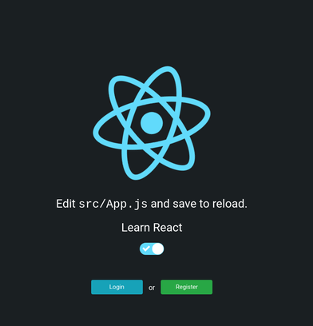
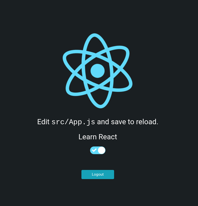
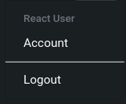

# CRA template keycloak starter

Table of contents

- [Motivation](#motivation)
- [Installation](#installation)
- [Configuration](#configuration)
- [Start](#start)
- [Login](#login)
- [Usermenu](#usermenu)
- [Further information](#further-information)

This template is based on [cra-template-using-atomic-design](https://github.com/danielschlieder/cra-template-using-atomic-design). Please find the original documentation [here](https://raw.githubusercontent.com/danielschlieder/cra-template-using-atomic-design/main/README.md)

# Motivation

I created this template to be ablte to create react apps, with a connected IAM (instead of developing everything myself).

Whereas many solutions are available (Auth0, Okta and many more), this CRA is configured to use [Keycloak](https://www.keycloak.org/) to manage users.

# Installation

As usual:

```
npx create-react-app --template keycloak-starter my-app
```

# Configuration

Your Keycloak host must be configured in `src/keycloak.js`.

Create a realm for this CRA if needed. The defaults - provided by Keycloak on realm creation, seem to work flawlessly, at least for me. If you want the register function to work, you need to enable this feature, when creating the realm.

If your Keycloak host is misconfigured, your app will stay in preloading state, reading "Contacting keycloak host ...".

Edit `src/keycloak.js`

```
import Keycloak from "keycloak-js";
const keycloak = Keycloak({
  url: "https://__YOUR_KEYCLOAK_HOST__/auth/",
  realm: "__REALM_NAME__",
  clientId: "__CLIENTID__",
});

export default keycloak;

```

# Start

As usual:

```
cd my-app && npm run start
```

You will see the default CRA with login and register buttons.



# Login

Login with a Keycloak user or register a new one
You will see the how the buttons have become a logout button.



Check the [source](./src/components/pages/default/index.js) of how easy you switch the buttons.

# Usermenu

Further I added a simply usermenu. The link "account" will redirect you to the keycloak host and opens your account details there.



# Further information

The Keycloak part of this CRA, is based on the [examples](https://github.com/react-keycloak/react-keycloak-examples) found in the package [@react-keycloak/web
](https://www.npmjs.com/package/@react-keycloak/web), used to connect react with keycloak.
